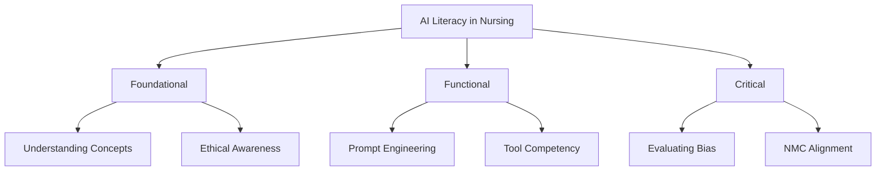

# Developing AI Literacy in Multimodal Context

:::info Attribution
**Original work**: "Educators' guide to multimodal learning and Generative AI" — Tünde Varga-Atkins, Samuel Saunders, et al. (2024/25) — [CC BY-NC 4.0](https://creativecommons.org/licenses/by-nc/4.0/)  
**Adapted for UK Nursing Education by**: Lincoln Gombedza, RN (LD)  
**Last Updated**: December 2025
:::

In the previous section, we emphasised the importance of the critical and responsible use of GenAI in education. This is tied to developing **AI literacy**, enabling educators and learners to effectively and critically engage with GenAI in a multimodal learning context.

## Why AI Literacy Matters in Nursing

:::tip Critical Importance
Developing AI literac(ies) is of critical importance whether you're engaging or disengaging from the technology. If one does not understand the platforms, their functions, contexts, impacts and perceptions, one cannot justifiably use it, or justifiably reject it.
:::

**For nursing specifically**:
- Nurses are increasingly encountering AI in clinical practice
- AI is embedded in patient monitoring systems, diagnostic tools, and care planning software  
- Future nurses must understand how to work alongside AI safely and effectively
- NMC standards require competence in digital technologies
- Professional accountability demands understanding the tools we use

## Three Levels of AI Literacy

Below are some basic approaches that may help nursing educators begin fostering GenAI literacy in their staff and student audiences:

### 🟢 Basic Literacy

**Awareness** of multimodal GenAI platforms, their capabilities, and appropriate uses in educational context.

**Example nursing activities**:
- Creating prompts for patient scenario generation
- Generating visual care pathway diagrams
- Understanding when GenAI is appropriate vs. inappropriate (e.g., NOT for calculating drug doses)

### 🟡 Intermediate Literacy

**Ability** to co-create multimodal content, critically evaluate multimodal AI outputs, and scaffold uses.

**Example nursing activities**:
- Transforming lecture notes on wound care into visuals or podcasts
- Critically evaluating AI-generated patient scenarios for accuracy
- Identifying biases in AI-generated health information

### 🔴 Advanced Literacy

**Designing** activities or assessments that incorporate multimodal uses of GenAI, fostering critical analysis and engagement, and leading ethical and philosophical discussions.

**Example nursing activities**:
- Creating assessment rubrics that incorporate appropriate AI use
- Leading discussions on AI ethics in healthcare
- Designing clinical simulations that integrate AI tools appropriately

---

## Key Teaching Competencies

### 1. Scaffolded Prompting

Advising students how to craft and iterate on prompts to refine multimodal GenAI outputs.

**Nursing Example**:
```
Poor prompt: "Create a care plan"

Better prompt: "Create a person-centred care plan for a 75-year-old patient 
with Type 2 diabetes and limited mobility, focusing on falls prevention and 
medication adherence. Use the Roper-Logan-Tierney model."
```

### 2. Evaluation Frameworks

Encouraging students to critique GenAI content for accuracy, bias, and coherence.

**Nursing Example**: Have students examine and annotate AI-generated wound assessment documentation, identifying:
- Factual errors
- Missing clinical details
- Inappropriate language
- Bias issues

### 3. Ethical Protocols

Establishing clear boundaries on acceptable use.

**Example boundaries**:
- ❌ Do NOT use AI to write reflective practice assignments (personal reflection required)
- ✅ DO use it for brainstorming clinical teaching scenarios
- ❌ Do NOT input real patient data into public AI tools
- ✅ DO use it to generate example ECG rhythms for practice

---

## Strategies Across Different Levels

### Individual Level

**Students**:
- Participate in workshops on GenAI use in nursing tasks  
- Practice prompt crafting for clinical scenarios
- Document AI usage in reflective assignments

**Educators**:
- Engage in professional learning (e.g., HEE digital capabilities framework)
- Experiment with low-stakes uses of GenAI
- Reflect on ethical practices

**Practice Educators**:
- Model safe AI use in clinical settings
- Demonstrate how to verify AI outputs against evidence-based guidelines
- Share examples with student nurses

### Module Level

- Embed GenAI literacy into learning outcomes (e.g., 'critically evaluate AI-generated clinical decision support')
- Offer optional multimodal tasks that include GenAI use with clear rubrics
- Include creative and reflective components where students analyse their own AI use

**Example module outcome**:
> "Students will demonstrate the ability to critically evaluate AI-generated health information and verify it against authoritative nursing sources (NMC, NICE, Cochrane)."

### Programme Level

- Develop cross-module policies and examples on GenAI use
- Promote consistency and transparency via workshops and activities
- Align GenAI practices with graduate attributes such as criticality, creativity, and digital fluency
- Consider embedding AI literacies in academic skills modules shared across programmes

**For UK nursing programmes**, align with:
- NMC Standards of Proficiency for Registered Nurses
- Health Education England Digital Literacy Framework
- NHS Digital Capabilities Framework

### Institutional Level

- Provide clear policies on GenAI use in learning and teaching
- Offer vetted tools and ensure data privacy protocols are enforced
- Create professional development pathways
- Support communities of practice (e.g., Digital Nursing Innovators groups)
- Showcase successful implementations to build confidence
- Offer platforms for debate and critique

---

## Next Steps for Nursing Educators

1. **Assess current literacy** — Where are you? Where are your students?
2. **Start small** — Pick one module to experiment with AI literacy activities
3. **Build competencies** — Use the frameworks above to structure development
4. **Share practice** — Join communities like FONS, RCN digital groups, or nursing education networks
5. **Align with standards** — Map to NMC competencies and HEE frameworks

:::tip Get Started
Begin with simple activities like having students generate and critique AI-created patient scenarios, then build up to more complex applications.
:::

---

**Explore more**:
- [Practical teaching strategies](../teaching/) for integrating AI literacy
- [Assessment approaches](../assessment/) that evaluate AI competency
- [Case studies](/docs/category/case-studies) showing AI literacy in action
