import Tabs from '@theme/Tabs';
import TabItem from '@theme/TabItem';

# Developing AI Literacy in Multimodal Context

:::info Attribution
**Original work**: "Educators' guide to multimodal learning and Generative AI" — Tünde Varga-Atkins, Samuel Saunders, et al. (2024/25) — [CC BY-NC 4.0](https://creativecommons.org/licenses/by-nc/4.0/)  
**Adapted for UK Nursing Education by**: Lincoln Gombedza, RN (LD)  
**Last Updated**: December 2025
:::

In the previous section, we emphasised the importance of the critical and responsible use of GenAI in education. This is tied to developing **AI literacy**, enabling educators and learners to effectively and critically engage with GenAI in a multimodal learning context.

## Why AI Literacy Matters in Nursing

:::tip Critical Importance
Developing AI literac(ies) is of critical importance whether you're engaging or disengaging from the technology. If one does not understand the platforms, their functions, contexts, impacts and perceptions, one cannot justifiably use it, or justifiably reject it.
:::

**For nursing specifically**:
- 🏥 **Clinical Reality**: Nurses are increasingly encountering AI in patient monitoring and diagnostics.
- 🛡️ **Safety**: Future nurses must understand how to work alongside AI safely and effectively.
- 📜 **Regulation**: NMC standards require competence in digital technologies.
- ⚖️ **Accountability**: Professional accountability demands understanding the tools we use.

---

## 📐 Three Levels of AI Literacy

We visualize AI literacy as a progressive journey. You don't need to be an expert immediately; start at the base and build up.

```mermaid
graph BT
    Basic[🟢 Basic Literacy<br/>Awareness & Safe Use] --> Inter[🟡 Intermediate Literacy<br/>Co-creation & Evaluation]
    Inter --> Adv[🔴 Advanced Literacy<br/>Design, Ethics & Leadership]
    
    style Basic fill:#e6fffa,stroke:#319795,stroke-width:2px
    style Inter fill:#fffaf0,stroke:#dd6b20,stroke-width:2px
    style Adv fill:#fff5f5,stroke:#e53e3e,stroke-width:2px
```

### 🟢 Basic Literacy
**Awareness** of multimodal GenAI platforms, their capabilities, and appropriate uses in educational context.

:::note 🩺 Nursing Activities
- Creating prompts for patient scenario generation
- Generating visual care pathway diagrams
- Understanding when GenAI is appropriate vs. inappropriate (e.g., **NOT** for calculating drug doses)
:::

### 🟡 Intermediate Literacy
**Ability** to co-create multimodal content, critically evaluate multimodal AI outputs, and scaffold uses.

:::note 🩺 Nursing Activities
- Transforming lecture notes on wound care into visuals or podcasts
- Critically evaluating AI-generated patient scenarios for accuracy
- Identifying biases in AI-generated health information

:::info 🧩 LD Nursing Spotlight: Easy Read Co-creation
**Activity**: Use AI to draft an "Easy Read" guide for a gastrostomy procedure.
**Skill**: Critically evaluate the AI's language—is it truly accessible? Does it follow [Photosymbols](https://www.photosymbols.com/) principles?
:::
:::

### 🔴 Advanced Literacy
**Designing** activities or assessments that incorporate multimodal uses of GenAI, fostering critical analysis and engagement, and leading ethical and philosophical discussions.

:::note 🩺 Nursing Activities
- Creating assessment rubrics that incorporate appropriate AI use
- Leading discussions on AI ethics in healthcare
- Designing clinical simulations that integrate AI tools appropriately
:::

---

## 🎓 Key Teaching Competencies

To teach effectively with AI, focus on these three core skills:

  

    

      

        <h3>1. Scaffolded Prompting</h3>
      

      

        
Advising students how to craft and iterate on prompts to refine outputs.

        

        ❌ <strong>Poor:</strong> "Create a care plan"
        

        

        ✅ <strong>Better:</strong> "Create a person-centred care plan for a 75-year-old patient with Type 2 diabetes..."
        

      

    

  

  

    

      

        <h3>2. Evaluation Frameworks</h3>
      

      

        
Encouraging students to critique GenAI content for:

        <ul>
            <li>Accuracy</li>
            <li>Bias (e.g., skin tone representation)</li>
            <li>Coherence</li>
            <li>Evidence-base</li>
        </ul>
      

    

  

  

    

      

        <h3>3. Ethical Protocols</h3>
      

      

        
Establishing clear boundaries:

        <ul>
            <li>❌ No personal data input</li>
            <li>❌ No AI for pure reflection</li>
            <li>✅ Use for clinical brainstorming</li>
            <li>✅ Use for scenario generation</li>
        </ul>
      

    

  

---

## 🚀 Strategies Across Different Levels

Select your level of operation to see specific strategies:

<Tabs>
  <TabItem value="individual" label="👤 Individual" default>
    
    ### For Students
    - **Workshop Participation**: Join sessions on GenAI use in nursing tasks.
    - **Prompt Practice**: Practice crafting prompts for clinical scenarios.
    - **Transparency**: Document AI usage in reflective assignments.

    ### For Educators
    - **CPD**: Engage in professional learning (e.g., HEE digital capabilities framework).
    - **Experimentation**: Try low-stakes uses of GenAI (e.g., generating quiz questions).
    - **Reflection**: Reflect on the ethical implications of your tools.

    ### For Practice Educators
    - **Modeling**: Demonstrate safe AI use in clinical settings.
    - **Verification**: Show students how to cross-reference AI outputs with **NICE Guidelines** or **BNF**.

  </TabItem>
  <TabItem value="module" label="📦 Module Level">
    
    ### Curriculum Integration
    - **Learning Outcomes**: Embed GenAI literacy (e.g., *'critically evaluate AI-generated clinical decision support'*).
    - **Assessment**: Offer optional multimodal tasks that include GenAI use with clear rubrics.
    - **Reflection**: Include components where students analyse their own AI interaction.

    :::tip Example Module Outcome
    "Students will demonstrate the ability to critically evaluate AI-generated health information and verify it against authoritative nursing sources (NMC, NICE, Cochrane)."
    :::

  </TabItem>
  <TabItem value="programme" label="🎓 Programme Level">
    
    ### Strategic Alignment
    - **Consistency**: Develop cross-module policies to ensure students don't face conflicting rules.
    - **Graduate Attributes**: Align GenAI practices with critical thinking and digital fluency.
    - **Shared Resources**: Embed AI literacies in academic skills modules shared across programmes.

    ### Align with Standards
    *   **NMC** Standards of Proficiency for Registered Nurses
    *   **Health Education England** Digital Literacy Framework
    *   **NHS** Digital Capabilities Framework

  </TabItem>
  <TabItem value="institution" label="🏛️ Institutional Level">
    
    ### Policy & Infrastructure
    - **Clear Policies**: Define acceptable use for learning vs. assessment.
    - **Vetted Tools**: Ensure data privacy protocols (GDPR) are enforced.
    - **Development Pathways**: Create training for staff.
    - **Communities of Practice**: Support groups like "Digital Nursing Innovators" to share best practice.

  </TabItem>
</Tabs>

---

## Next Steps for Nursing Educators

1.  **Assess current literacy** — Where are you? Where are your students?
2.  **Start small** — Pick one module to experiment with AI literacy activities
3.  **Build competencies** — Use the frameworks above to structure development
4.  **Share practice** — Join communities like FONS, RCN digital groups, or nursing education networks
5.  **Align with standards** — Map to NMC competencies and HEE frameworks

:::tip Get Started Now
Begin with a simple activity: ask students to generate a patient scenario using AI, then critique it for **clinical accuracy** and **person-centredness**.
:::
