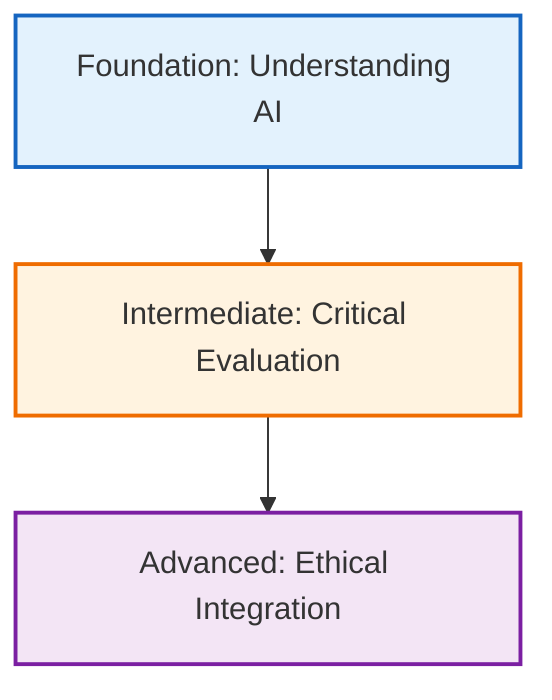

import Tabs from '@theme/Tabs';
import TabItem from '@theme/TabItem';
import InteractiveChecklist from '@site/src/components/InteractiveChecklist';
import { COMPETENCY_DATA } from '@site/src/components/InteractiveChecklist/data_competencies';

# Individual AI Competencies

:::info Attribution
**Original work**: "Educators' guide to multimodal learning and Generative AI" — Tünde Varga-Atkins, Samuel Saunders, et al. (2024/25) — [CC BY-NC 4.0](https://creativecommons.org/licenses/by-nc/4.0/)  
**Adapted for UK Nursing Education by**: Lincoln Gombedza, RN (LD)  
**Last Updated**: December 2025
:::

AI literacy is not just about using tools—it's about developing critical competencies that enable safe, effective, and ethical integration of AI into nursing practice. This page outlines the core competencies every nursing student should develop.

## 📐 AI Literacy Framework for Nursing

  

    

      

        <h3>1. Foundation Level</h3>
      

      

        
<strong>Understanding AI</strong>

        <ul>
            <li>Recognize different types of AI</li>
            <li>Identify capabilities & limitations</li>
            <li>Understand training data & bias</li>
        </ul>
      

      

        :::note Nursing Application
        Explain AI in patient-friendly language and identify safe vs unsafe clinical scenarios.
        :::
      

    

  

  

    

      

        <h3>2. Intermediate Level</h3>
      

      

        
<strong>Critical Evaluation</strong>

        <ul>
            <li>Evaluate outputs for accuracy</li>
            <li>Identify bias & errors</li>
            <li>Compare with evidence-base</li>
        </ul>
      

      

        :::note Nursing Application
        Verify AI clinical info against <strong>NICE guidelines</strong> and identify bias in care recommendations.
        :::
      

    

  

  

    

      

        <h3>3. Advanced Level</h3>
      

      

        
<strong>Ethical Integration</strong>

        <ul>
            <li>Apply ethical frameworks</li>
            <li>Maintain confidentiality</li>
            <li>Advocate for responsible use</li>
        </ul>
      

      

        :::note Nursing Application
        Ensure alignment with <strong>NMC Code</strong> and lead patient-centered AI implementation.
        :::
      

    

  

---

## 🧠 Core Competency Domains

  

    

      

        <h3>💻 Technical</h3>
      

      

        
<strong>Skills:</strong> Prompt crafting, tool navigation, troubleshooting.

        
<strong>Nursing Use:</strong> Creating care plans, simulations, and study resources.

      

    

  

  

    

      

        <h3>📚 Info Literacy</h3>
      

      

        
<strong>Skills:</strong> Source verification, evidence checking, citing AI.

        
<strong>Nursing Use:</strong> <strong>Always</strong> verify against NICE/Cochrane. AI is a starting point, not an endpoint.

      

    

  

  

    

      

        <h3>🤔 Critical Thinking</h3>
      

      

        
<strong>Skills:</strong> Questioning assumptions, detecting hallucinations, logic checks.

        
<strong>Nursing Use:</strong> Applying clinical judgement independently of AI suggestions.

      

    

  

  

    

      

        <h3>⚖️ Ethical Awareness</h3>
      

      

        
<strong>Skills:</strong> Privacy, GDPR, academic integrity, bias mitigation.

        
<strong>Nursing Use:</strong> <strong>Never</strong> input patient data. Uphold the NMC Code at all times.

      

    

  

  

    

      

        <h3>💬 Communication</h3>
      

      

        
<strong>Skills:</strong> Explaining AI to others, transparent disclosure, collaboration.

        
<strong>Nursing Use:</strong> Reassuring patients about AI tools and training colleagues.

      

    

  

---

## 🎓 Competency Development Pathway

Select a year to see the progression logic:

<Tabs>
  <TabItem value="year1" label="Year 1: Foundation" default>
    
    ### Learning Outcomes
    - Understand basic AI concepts & limitations
    - Use AI tools safely protecting patient data
    - Practice ethical use & academic integrity

    ### Key Activities
    *   **Workshops**: Introduction to AI literacy
    *   **Exploration**: Guided prompt engineering exercises
    *   **Ethics**: Case discussions on privacy and bias

    ### Assessment
    - AI knowledge quiz
    - Basic prompt crafting exercise
    - Reflective portfolio entry on "My First AI Interaction"

  </TabItem>
  <TabItem value="year2" label="Year 2: Integration">
    
    ### Learning Outcomes
    - Apply AI to nursing scenarios & care planning
    - Evaluate clinical relevance & accuracy
    - Integrate AI results with evidence-based practice

    *   **Care Planning**: AI-enhanced care plan drafting (critiqued)
    *   **Simulation**: Clinical scenario analysis
    *   **Creation**: Developing patient education materials

    :::tip 🧠 Learning Disability Focus
    **Assistive Technology**: Use voice-to-text AI to support communication for people with physical disabilities. 
    **Task**: Evaluate if the AI accurately interprets non-standard speech patterns.
    :::

    ### Assessment
    - Critical appraisal of an AI-generated care plan
    - Evidence-based practice assignment (comparing AI vs NICE)
    - Peer teaching session

  </TabItem>
  <TabItem value="year3" label="Year 3: Mastery">
    
    ### Learning Outcomes
    - Demonstrate advanced AI literacy & leadership
    - Mentor peers in safe AI use
    - contribute to policy & advocacy

    ### Key Activities
    *   **Complex Support**: Using AI for complex decision support (with critique)
    *   **QI Projects**: Quality improvement initiatives using AI
    *   **Mentoring**: Guiding junior students

    ### Assessment
    - Advanced clinical scenario management
    - Leadership project or policy contribution
    - Capstone portfolio showcasing AI fluency

  </TabItem>
</Tabs>

---

## ✅ Interactive Checkist

Track your progress against the core competencies:

<InteractiveChecklist data={COMPETENCY_DATA} fileName="AI_Competency_Report" />

---

## 🔗 Development Resources

### Self-Directed Learning
- Online AI literacy courses
- Nursing informatics resources
- Professional body guidance (RCN/NMC)

### Institutional Support
- Workshops and mentoring programs
- Communities of practice (Join our [GitHub Discussions](https://github.com/ClinyQAi/nursing-ai-toolkit/discussions)!)

### Continuous Learning
- Stay current with AI developments (it moves fast!)
- **Regular Review**: Self-assess competencies annually

---

**Next**: Explore [Module Integration](/docs/ai-literacy/module-integration) to see how these competencies are developed through curriculum.
