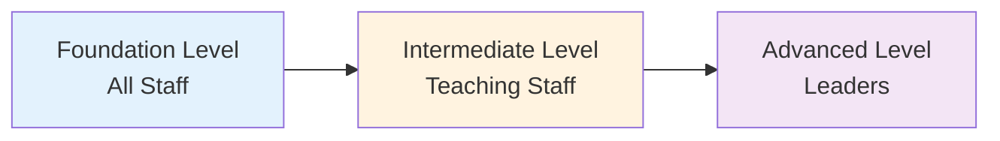

# Institutional AI Literacy Framework

:::info Attribution
**Original work**: "Educators' guide to multimodal learning and Generative AI" — Tünde Varga-Atkins, Samuel Saunders, et al. (2024/25) — [CC BY-NC 4.0](https://creativecommons.org/licenses/by-nc/4.0/)  
**Adapted for UK Nursing Education by**: Lincoln Gombedza, RN (LD)  
**Last Updated**: December 2025
:::

## 🎯 What is This Document For?

This framework is a **blueprint for university leaders** who want to integrate AI across their nursing programmes in a sustainable, ethical, and NMC-aligned way.

**If you are:**
- 🏛️ **Senior Leadership**: Use this to align institutional strategy with AI innovation
- 👨‍🏫 **Programme Leaders**: Use this to design governance structures and policies
- 🤝 **Practice Partners**: Use this to align placement policies with university standards

:::tip Quick Start
If you're overwhelmed, start with the **[Policy Framework](#policy-framework)** section and the **Risk Management** checklist.
:::

---

## 📊 Framework Overview

This framework is organized around **5 Pillars**:

| Pillar | What It Covers | Key Stakeholders |
| :--- | :--- | :--- |
| **1. Governance** | Steering groups, working groups, accountability | Senior Leadership |
| **2. Policy** | Acceptable use, academic integrity, data protection | All Staff, Students |
| **3. Infrastructure** | AI tool access, IT support, learning resources | IT Services, Library |
| **4. Staff Development** | Training pathways, communities of practice | Academic Staff |
| **5. Quality Assurance** | Monitoring, evaluation, continuous improvement | QA Teams, External Examiners |

---

## 1️⃣ Governance Structure

### AI Literacy Steering Group

**Purpose**: Oversee institutional AI strategy and ensure alignment with NMC standards.

**Composition**:
- Senior leadership (Chair)
- Programme leaders
- Student representatives
- Practice partners
- IT & Library services

**Responsibilities**:
- 📜 Policy development
- 💰 Resource allocation
- 📈 Quality monitoring
- ⚠️ Risk management

**Meeting Frequency**: Quarterly with annual review

### Working Groups

🛠️ Curriculum Development Group

- Design AI-integrated curriculum
- Create learning resources
- Develop assessments
- Share best practices

👥 Staff Development Group

- Training programmes
- Support networks
- Research opportunities
- Innovation projects

✅ Quality Assurance Group

- Monitor standards
- Evaluate outcomes
- Address issues
- Continuous improvement

---

## 2️⃣ Policy Framework {#policy-framework}

### Core Principles

The institutional AI policy must be built on these **5 Pillars**:

1. **Student-Centered**: AI enhances learning, not replaces critical thinking
2. **Ethical**: Responsible and transparent use
3. **Evidence-Based**: Informed by research and best practice
4. **Inclusive**: Equitable access for all students
5. **Sustainable**: Environmentally and financially conscious

### Key Policy Components

| Component | What It Includes |
| :--- | :--- |
| **Acceptable Use** | What students MAY and MUST NOT use AI for |
| **Data Protection** | GDPR compliance, patient confidentiality rules |
| **Academic Integrity** | Disclosure requirements, consequences for misuse |
| **Assessment Regulations** | AI-resilient assessment design guidance |
| **Support Provisions** | Where students go for help |

### Implementation Guidance

📚 For Students

- **Clear Expectations**: What's allowed vs. prohibited
- **Disclosure Requirements**: How to cite AI use
- **Support Resources**: Where to get help
- **Consequences**: What happens if policies are violated
- **Appeals Process**: How to challenge decisions

🎓 For Staff

- **Teaching Guidance**: How to integrate AI into lessons
- **Assessment Design**: Creating AI-resilient assessments
- **Tool Recommendations**: Which AI tools are approved
- **Support Access**: Where staff go for training
- **Professional Development**: Ongoing learning opportunities

🏥 For Practice Partners

- **Placement Policies**: AI use in clinical settings
- **Mentor Guidance**: Supporting students using AI
- **Assessment Alignment**: Ensuring consistency
- **Communication Protocols**: Who to contact with concerns

---

## 3️⃣ Infrastructure & Resources

### Technology Access

**Essential Tools**:
- Institutional subscriptions (ChatGPT, Claude, etc.)
- Specialized nursing AI tools
- VLE integration (Moodle/Blackboard)
- Mobile accessibility
- 24/7 technical support

### Learning Resources

**Digital Library**:
- 📖 AI literacy guides
- 🎥 Video tutorials
- 📊 Case studies
- 📝 Assessment exemplars
- 🔬 Research papers

**Physical Support**:
- 🛠️ Drop-in workshops
- 👤 One-to-one support
- 👫 Peer mentoring
- 💻 Practice labs

---

## 4️⃣ Staff Development Programme

### Training Pathway

**Foundation Level** (All Staff):
- AI basics and terminology
- Institutional policies
- Ethical considerations

**Intermediate Level** (Teaching Staff):
- Pedagogical integration
- Assessment design
- Student support strategies

**Advanced Level** (Leaders/Innovators):
- Strategic planning
- Research methods
- Policy development

### Support Mechanisms

- **Communities of Practice**: Regular meetings to share innovation
- **Mentoring**: Peer-to-peer support
- **Research Opportunities**: Scholarships, publications, conference funding

---

## 5️⃣ Quality Assurance Framework

### Key Metrics

| Metric | Data Source | Frequency |
| :--- | :--- | :--- |
| Student AI literacy levels | Student surveys | Annual |
| Staff confidence | Staff feedback | Biannual |
| Assessment outcomes | Module analytics | Per semester |
| Academic integrity incidents | Registry data | Ongoing |
| Stakeholder satisfaction | External examiner reports | Annual |

### Continuous Improvement Cycle

1. **Collect Data** → Surveys, analytics, feedback
2. **Analyze** → Identify trends, gaps, successes
3. **Report** → Quarterly dashboards, annual reports
4. **Adjust** → Policy updates, resource reallocation
5. **Repeat** → Ongoing cycle

---

## ⚠️ Risk Management

### Identified Risks & Mitigation Strategies

🚨 Academic Integrity Risks

**Risks**:
- Undisclosed AI use
- Over-reliance on AI
- Plagiarism

**Mitigation**:
- ✅ Clear policies and education
- ✅ AI-resilient assessment design (Vivas, process-based tasks)
- ✅ Ethical use of detection tools (not as sole evidence)
- ✅ Student support and training

⚖️ Equity & Access Risks

**Risks**:
- Digital divide (students without laptops)
- Unequal resources
- Disability barriers

**Mitigation**:
- ✅ Institutional subscriptions (free for all students)
- ✅ Device loan schemes
- ✅ Accessibility features
- ✅ Alternative provisions

🔒 Data Privacy Risks

**Risks**:
- Patient confidentiality breaches
- GDPR violations
- Data security

**Mitigation**:
- ✅ Clear "Never Input Patient Data" guidelines
- ✅ Mandatory training
- ✅ Monitoring and audits
- ✅ Incident response plan

---

## 🤝 Stakeholder Engagement

### Student Partnership

**How Students Are Involved**:
- 📝 Policy co-creation
- 🛠️ Resource development
- 💬 Feedback mechanisms
- 🚀 Innovation projects

**Communication Channels**:
- Regular town halls
- Student representatives on steering group
- Digital feedback forms

### Practice Partner Collaboration

**Engagement Activities**:
- Joint policy development
- Mentor training
- Best practice sharing
- Quality assurance reviews

### Professional Body Liaison

:::tip NMC AI Standards Timeline
The NMC is currently reviewing its Code to integrate AI standards. Consultation expected **Q3-Q4 2026**, with publication in **October 2027**. Institutions should actively participate in the consultation process.
:::

**Key Relationships**:
- 🏛️ **NMC**: Standards alignment, inspection preparation
- 🩺 **RCN**: Professional development, research partnerships

---

## 🌱 Sustainability

### Environmental Considerations

**Green AI Practices**:
- Use energy-efficient AI tools
- Sustainable procurement policies
- Carbon offsetting where necessary
- Educate students on AI's environmental impact

### Financial Sustainability

**Funding Model**:
- Institutional investment (base funding)
- External grants (innovation projects)
- Cost-benefit analysis (ROI tracking)
- Long-term financial planning

---

## ✅ Implementation Checklist

Use this to track your institutional readiness:

- [ ] Steering group established
- [ ] AI policy drafted and approved
- [ ] Staff training programme launched
- [ ] AI tool subscriptions secured
- [ ] Student support resources created
- [ ] Quality assurance metrics defined
- [ ] Risk management plan in place
- [ ] Practice partner engagement confirmed
- [ ] NMC alignment verified

---

**Congratulations!** You've completed the AI Literacy section. Continue exploring other sections of the toolkit.
