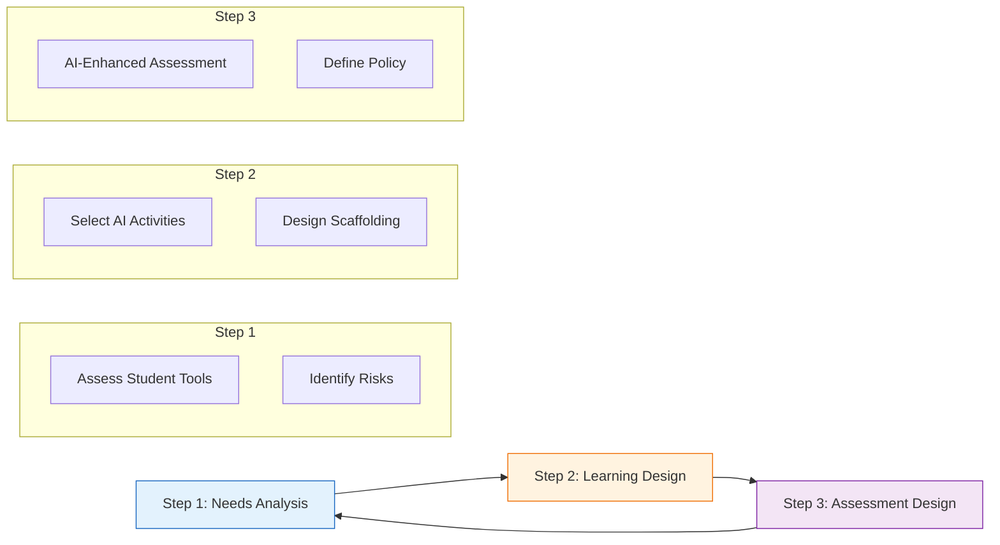

import Tabs from '@theme/Tabs';
import TabItem from '@theme/TabItem';

# Module-Level AI Literacy Integration

:::info Attribution
**Original work**: "Educators' guide to multimodal learning and Generative AI" — Tünde Varga-Atkins, Samuel Saunders, et al. (2024/25) — [CC BY-NC 4.0](https://creativecommons.org/licenses/by-nc/4.0/)  
**Adapted for UK Nursing Education by**: Lincoln Gombedza, RN (LD)  
**Last Updated**: December 2025
:::

Integrating AI literacy into individual modules ensures students develop competencies progressively and contextually. This page provides practical guidance for module leaders.

## 📐 Module Design Principles

:::tip Context is King
Avoid generic "AI Training." Always embed AI literacy within the clinical context of your module (e.g., using AI for *care planning* in a nursing process module, or for *communication simulation* in a therapeutic practice module).
:::

### 1. Alignment with Learning Outcomes
*   **Explicit**: Include AI competencies directly in learning outcomes.
*   **Mapped**: Ensure alignment with **NMC standards** (e.g., digital literacy, evidence-based practice).

### 2. Contextual Integration
*   ✅ **DO**: Relate AI to specific clinical tasks (care plans, discharge summaries).
*   ❌ **DON'T**: Teach technology for technology's sake.

---

## 🔄 Module Planning Framework

Follow this 3-step cycle to integrate AI effectively:

---

## 📚 Example Module Plans

Explore how AI integration looks across different fields of nursing:

<Tabs>
  <TabItem value="adult" label="Adult Nursing" default>

    ### 🫁 Care Planning Module (Year 2)
    **Focus**: Holistic care planning & Evidence-based practice

    #### Learning Outcomes
    1. Develop evidence-based care plans using tools including AI.
    2. **Critically evaluate** AI-generated recommendations against **NICE guidelines**.
    3. Demonstrate ethical AI use (privacy/accountability).

    #### Key Activities
    *   **Week 3 (Demo)**: Facilitator demonstrates generating a care plan and highlighting errors.
    *   **Week 4 (Workshop)**: Students generate plans for complex case studies and **red-pen** the hallucinations.
    *   **Week 5 (Ethics)**: Discussion on data privacy and professional accountability.

    #### Assessment: AI-Enhanced Portfolio
    *   **Task**: Submit an AI-generated draft + a final human-edited version.
    *   **Requirement**: A 500-word reflection on *why* changes were made.
    *   **Success Criteria**: Accurate error identification and evidence-based modifications.

  </TabItem>
  <TabItem value="mental_health" label="Mental Health">

    ### 🧠 Therapeutic Communication (Year 2)
    **Focus**: Communication skills & Empathy

    #### Learning Outcomes
    1. Practice therapeutic communication using AI simulations.
    2. Evaluate AI's inability to understand **human emotion**.
    3. Maintain a person-centered approach despite technology.

    #### Key Activities
    *   **Week 2 (Roleplay)**: Use text-based AI to simulate a patient conversation.
    *   **Week 4 (Analysis)**: Compare AI's "empathy" to genuine human connection.
    *   **Week 6 (Ethics)**: Discuss professional boundaries in digital communication.

    #### Assessment: Reflective Video
    *   **Task**: Record a response to an AI-generated patient scenario.
    *   **Requirement**: Critique the AI's portrayal of mental health conditions (stereotypes vs. reality).

  </TabItem>
  <TabItem value="child" label="Child Nursing">

    ### 👶 Health Promotion (Year 3)
    **Focus**: Family health & Developmental appropriateness

    #### Learning Outcomes
    1. Create age-appropriate health materials using Generative AI (images/text).
    2. Evaluate content for **developmental stages**.
    3. Adapt resources for diverse family needs.

    #### Key Activities
    *   **Week 3 (Creation)**: Generate a visual storyboard for a "Going to Theatre" guide.
    *   **Week 5 (Critique)**: Assess if the language is truly child-friendly or just "dumbed down."
    *   **Week 7 (Inclusion)**: Adapt materials for non-English speaking families using AI translation (with verification).

    #### Assessment: Resource Pack
    *   **Task**: Create a health promotion pack.
    *   **Requirement**: Justify developmental choices and how AI bias was mitigated.

  </TabItem>
  <TabItem value="ld" label="Learning Disability">

    ### ♿ Accessible Information (Year 2)
    **Focus**: Health Inequalities & Reasonable Adjustments

    #### Learning Outcomes
    1. Use AI to simplify complex medical text into **"Easy Read"**.
    2. Evaluate AI-generated images for respectful representation.
    3. Demonstrate understanding of **reasonable adjustments**.

    #### Key Activities
    *   **Week 2 (Standard)**: Workshop on Easy Read standards (images, text size).
    *   **Week 4 (Social Stories)**: Use AI to create a visual "Getting a Blood Test" story.
    *   **Week 6 (Risk)**: Discuss risk of AI hallucinating incorrect medical advice in simplified text.

    #### Assessment: Accessible Resource
    *   **Task**: Create a Hospital Passport.
    *   **Requirement**: Submission must show "Raw AI Output" vs "Final Version" to demonstrate human value.

  </TabItem>
</Tabs>

---

## ⚠️ Common Challenges & Solutions

Anticipate these hurdles when introducing AI:

| Challenge | 💡 Potential Solution |
| :--- | :--- |
| **Student Over-Reliance** | Design "AI-Free" components (e.g., oral defense) and require process documentation. |
| **Unequal Access** | Ensure all students have access to the same tools (institutional license) or use free tiers with clear guidance. |
| **Academic Misconduct** | Move from "product-based" assessment (the essay) to "process-based" (the portfolio/reflection). |
| **Staff Confidence** | Start small! Introduce AI in just one workshop before a full module rollout. |

---

## ✅ Implementation Checklist

### For Module Leaders

  

    <ul className="checklist">
      <li><input type="checkbox" disabled /> <strong>Review Policy</strong>: Check your institution's current AI assessment policy.</li>
      <li><input type="checkbox" disabled /> <strong>Tool Check</strong>: Ensure the chosen AI tool is GDPR compliant and accessible.</li>
      <li><input type="checkbox" disabled /> <strong>Update Handbook</strong>: Clearly state "AI Permitted" or "AI Prohibited" for each assessment.</li>
      <li><input type="checkbox" disabled /> <strong>Scaffold</strong>: Don't assume students know how to prompt; teach them.</li>
      <li><input type="checkbox" disabled /> <strong>Safety Net</strong>: Have a backup plan if the AI tool goes down during a session.</li>
    </ul>
  

---

## Assessment Assessment Taxonomy

1.  **🤖 AI-Enhanced**: Students *must* use AI (e.g., "Critique this AI care plan").
2.  **🤝 AI-Assisted**: Students *may* use AI for specific tasks (e.g., "Brainstorming ideas").
3.  **🚫 AI-Free**: No AI permitted (e.g., Clinical exams, Oral defense).

---

**Next**: Explore [Programme Strategy](/docs/ai-literacy/programme-strategy) for curriculum-wide integration.
