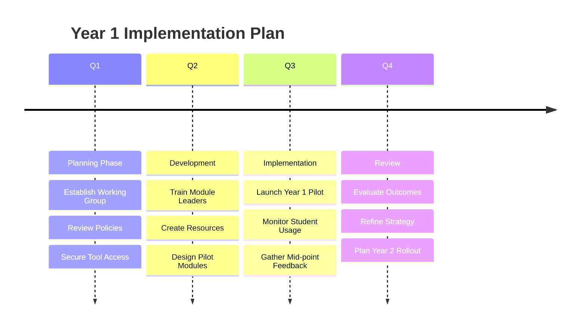

import Tabs from '@theme/Tabs';
import TabItem from '@theme/TabItem';

# Programme-Level AI Literacy Strategy

:::info Attribution
**Original work**: "Educators' guide to multimodal learning and Generative AI" — Tünde Varga-Atkins, Samuel Saunders, et al. (2024/25) — [CC BY-NC 4.0](https://creativecommons.org/licenses/by-nc/4.0/)  
**Adapted for UK Nursing Education by**: Lincoln Gombedza, RN (LD)  
**Last Updated**: December 2025
:::

A coherent programme-wide strategy ensures AI literacy develops progressively across the nursing curriculum, aligning with NMC proficiencies and preparing graduates for AI-enhanced practice.

## 🌟 Strategic Framework

### Vision Statement

> "To develop nursing graduates who are **AI-literate, critically engaged, and ethically grounded professionals** capable of integrating AI responsibly into person-centered care while maintaining professional accountability and clinical excellence."

### Strategic Objectives
1.  **Competency Development**: Ensure all graduates achieve core AI literacy competencies
2.  **Progressive Integration**: Build AI literacy systematically across three years
3.  **NMC Alignment**: Map AI competencies to NMC proficiencies
4.  **Quality Assurance**: Maintain high standards in AI-enhanced education
5.  **Ethical Practice**: Embed responsible AI use throughout curriculum

---

## 🗺️ Progressive Curriculum Mapping

We use a scaffolded approach: **Foundation** (Year 1) → **Reference** (Year 2) → **Mastery** (Year 3).

<Tabs>
  <TabItem value="year1" label="Year 1: Foundation" default>

    ### 🟢 Focus: Understanding & Awareness
    
    **Core Competencies**
    *   Basic AI concepts and terminology ("What is an LLM?")
    *   Safe and ethical AI tool use (Privacy first!)
    *   Critical evaluation of AI outputs (Hallucination checking)
    
    **Module Integration Points**
    *   **Foundations of Nursing**: Introduction to AI in healthcare contexts.
    *   **Academic Skills**: Using AI for brainstorming (but not writing) essays.
    *   **Evidence-Based Practice**: Distinguishing between AI summaries and primary research.

    **Key Assessment**
    *   **"My First Prompt"**: A reflective exercise on creating and critiquing a simple patient scenario.

  </TabItem>
  <TabItem value="year2" label="Year 2: Application">

    ### 🟡 Focus: Integration & Practice
    
    **Core Competencies**
    *   AI-enhanced clinical reasoning (Decision support)
    *   Evidence-based AI verification (Checking against NICE)
    *   Patient-centered AI application (Communication skills)

    **Module Integration Points**
    *   **Care Planning**: Generating and critiquing complex care plans.
    *   **Pharmacology**: Using AI to summarize drug interactions (then verifying in BNF).
    *   **Health Promotion**: Creating accessible leaflets for diverse groups.

    **Key Assessment**
    *   **The "Red Pen" Exercise**: Students are given a flawed AI-generated care plan and must identify all clinical errors and ethical risks.

  </TabItem>
  <TabItem value="year3" label="Year 3: Mastery">

    ### 🔴 Focus: Leadership & Innovation
    
    **Core Competencies**
    *   Advanced AI integration (Workflow optimization)
    *   Quality improvement with AI Data analysis
    *   Policy contribution & Advocacy (Leading the change)

    **Module Integration Points**
    *   **Leadership**: Managing teams using digital tools.
    *   **Quality Improvement**: Analyzing audit data patterns.
    *   **Transition to Practice**: Understanding the AI tools used in local NHS Trusts.

    **Key Assessment**
    *   **Innovation Project**: Design a quality improvement initiative that safely leverages AI to improve patient outcomes.

  </TabItem>
</Tabs>

---

## 📋 NMC Proficiency Mapping

How does this align with the **Future Nurse Standards (2018)**? Click to explore the mapping for each platform.

<strong>Platform 1: Being an Accountable Professional</strong>

*   **AI Integration**: Understand professional accountability. If AI gives wrong advice, **you** are accountable, not the algorithm.
*   **Evidence**: Reflective accounts of AI usage demonstrating full disclosure and checking against the Code.

<strong>Platform 2: Promoting Health and Preventing Ill Health</strong>

*   **AI Integration**: Use AI to draft health promotion materials (e.g., "Summarize this diabetes advice for an 8-Year old").
*   **Evidence**: Verified, clinically accurate patient information leaflets created with AI assistance.

<strong>Platform 3: Assessing Needs and Planning Care</strong>

*   **AI Integration**: AI-assisted holistic assessment prompts. Critically evaluating AI care plan suggestions for person-centredness.
*   **Evidence**: Care plans that explicitly note where AI was used for brainstorming and where human judgement applied corrections.

<strong>Platform 4: Providing and Evaluating Care</strong>

*   **AI Integration**: Using AI for decision support (e.g., "List potential differential diagnoses for these symptoms") but evaluating clinically.
*   **Evidence**: Clinical portfolios showing safe use of decision support tools.

<strong>Platform 5: Leading and Managing Nursing Care</strong>

*   **AI Integration**: Leadership in digital transformation. Teaching junior staff how to use tools safely.
*   **Evidence**: Teaching plan for a "Digital Safety" huddle.

<strong>Platform 6: Improving Safety and Quality of Care</strong>

*   **AI Integration**: Identifying how AI can reduce error (e.g., double-checking calculations) vs. where it introduces error (hallucination).
*   **Evidence**: Safety incident analysis involving digital tools.

<strong>Platform 7: Coordinating Care</strong>

*   **AI Integration**: Using tools to summarize complex discharge notes for interdisciplinary teams (while maintaining privacy).
*   **Evidence**: Simulated discharge letters edited for clarity and accuracy.

---

## 🚀 Implementation Roadmap

A sample timeline for rolling out this strategy in Year 1:

---

## 🤝 Stakeholder Engagement

To succeed, you need everyone on board:

| Stakeholder | Key Message | Support Required |
| :--- | :--- | :--- |
| **Students** | "AI helps you think, it doesn't think for you." | Clear workspaces, paid tool access (ideally), safety nets. |
| **Staff** | "You don't need to be a tech wizard, just a safe practitioner." | Time allowance for training, "Sandpits" for experimentation. |
| **Practice Partners** | "We are training nurses for the digital future of the NHS." | Alignment on what tools are permitted in clinical areas. |

---

**Next**: Explore [Institutional Framework](/docs/ai-literacy/institutional-framework) for university-wide strategy.
