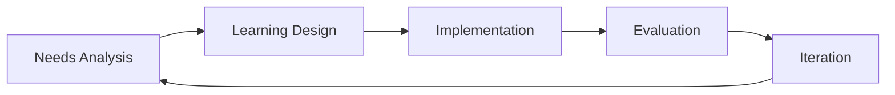

# Design Framework Overview

:::info Attribution
**Original work**: "Educators' guide to multimodal learning and Generative AI" — Tünde Varga-Atkins, Samuel Saunders, et al. (2024/25) — [CC BY-NC 4.0](https://creativecommons.org/licenses/by-nc/4.0/)  
**Adapted for UK Nursing Education by**: Lincoln Gombedza, RN (LD)  
**Last Updated**: December 2025
:::

Successfully integrating Generative AI into a nursing curriculum requires more than just picking a tool; it requires a structured pedagogical approach. This "Design Framework" provides a step-by-step methodology for educators to move from initial idea to a fully integrated, evaluated educational experience.

## The Design Process at a Glance

The framework follows a five-stage iterative process:

1.  **Needs Analysis**: Identifying the target audience, the clinical gap, and the desired learning outcomes.
2.  **Learning Design**: Selecting the appropriate AI modality and structuring the activity or assessment.
3.  **Implementation**: Preparing staff and students for the rollout of the AI-enhanced module.
4.  **Evaluation**: Measuring the impact on learning and student experience.
5.  **Iteration**: Refining the design based on feedback and the latest AI developments.

## Why Use a Framework?

By using a structured framework, nursing educators can:
-   **Ensure NMC Compliance**: Guarantee that AI use supports, rather than distracts from, professional proficiencies.
-   **Prioritize Safety**: Ensure that clinical scenarios are evidence-based and safe for learning.
-   **Increase Efficiency**: Avoid "reinventing the wheel" by following a proven pedagogical path.
-   **Foster Innovation**: Encourage creative yet disciplined experimentation with new multimodal AI features.

---

## Navigate this Section

-   **[Needs Analysis](./needs-analysis)**: Identifying the "Why" and "Who" before the "How."
-   **[Learning Design](./learning-design)**: Crafting the AI-enhanced experience.
-   **[Implementation Guide](./implementation-guide)**: Strategies for a successful rollout.
-   **[Evaluation & Iteration](./evaluation)**: Closing the loop for continuous improvement.

---

**Next**: Start with the first step: **[Needs Analysis](./needs-analysis)**.
