# AI in Nursing Education: A Multimodal Learning Toolkit

:::tip 👋 Welcome
I'm **Lincoln Gombedza, RN (LD)**. This toolkit is designed to help UK nursing educators harness the potential of Generative AI while maintaining the rigorous standards our profession demands.
:::

## 🌟 About This Toolkit

This resource is a **practical bridge** between pedagogical theory and nursing practice.

- **Built on Research**: Adapted from the *"Educators' guide to multimodal learning and Generative AI"* (Varga-Atkins et al., 2024/25)[^1].
- **Contextualised for Nursing**: Integrating **NMC standards**, clinical examples, and person-centred care principles.
- **For Educators**: Written for nurse academics, practice facilitators, and clinical educators.

🙏 Acknowledgments & Pioneers

This work stands on the shoulders of giants. A heartfelt thank you to:

**Academic Foundation**
* **Dr Tünde Varga-Atkins** (University of Liverpool) — For the foundational research guide.

**Mentors & Champions**
* **Aisha Holloway** (CNO Scotland) — For inspiring excellence.
* **Prof. Gemma Stacey** — For inspiring excellence.
* **Josie Rudman MBE** — For supporting nurse-led innovation.
* **Dr Clare Cable** — For supporting nurse-led innovation.
* **Janet Michel** — For championing global nursing.
* **Prof. Joanne Bosanquet** — For championing person-centred nursing.

**The "Nurse Citizen Developers"**
* **Kumbi Kariwo** — Champion of AI equity and bias mitigation.
* **Lorna Zvikomborero Magume** — An inspiration in person-centred care.
* **Hector Musonza** — Innovator in education and practice.
* **Rohit Sagoo** — Innovator in education and practice.
* **Dr Hellena Habte-Asres** — Innovator in education and practice.
* **Kelly Thobekile Ncube** — Innovator in education and practice.

---

## 🩺 Our Nursing Position on Generative AI

We align with the **ICN**, **NMC**, and **RCN**: AI is a tool to *augment*, not replace, nursing judgement.

### The "Middle Way" Approach

We reject both uncritical hype and complete rejection. Instead, we advocate for **Critical AI Fluency**:

```mermaid
graph LR
    A[Uncritical Hype] -->|❌ Too Risky| B((The Middle Way))
    C[Complete Rejection] -->|❌ Missed Opportunity| B
    B --> D[Critical Evaluation]
    B --> E[Ethical Use]
    B --> F[Human-Centred Care]
    
    style B fill:#d1e7dd,stroke:#0f5132,stroke-width:2px
```

### 5 Core Principles

| Principle | Why It Matters |
| :--- | :--- |
| **1. Lead, Don't Follow** | Nurses must be "Nurse Citizen Developers" who shape the tools we use (ICN, 2025). |
| **2. Augment, Don't Replace** | AI cannot replace empathy, touch, or therapeutic relationships (RCN, 2025). |
| **3. Accountability is Ours** | You remain professional accountable for all decisions, even AI-assisted ones (ANA, 2025). |
| **4. Ethical Vigilance** | We must rigorously check for bias (e.g., skin tone bias in wound care). |
| **5. Education Before Regulation** | Digital literacy is already an NMC requirement. We can't wait for the 2027 Code update. |

---

## 🎨 Why "Multimodal" Learning?

Nursing is inherently multimodal. We don't just "read" patients; we **observe**, **listen**, **touch**, and **sense**. Our teaching should reflect this using AI to create rich, diverse learning materials.

### Examples in Nursing:

- **📸 Visual**: AI-generated diagrams of pathophysiology.
- **🎧 Auditory**: Simulated patient voiceovers for history taking.
- **🎭 Simulation**: Text-based roleplay scenarios for communication skills.
- **📊 Data**: Interpreting AI-generated public health datasets.

---

## 🧭 Toolkit Navigation

Where should you start?

| If you are... | Go to... |
| :--- | :--- |
| **New to AI** | [**What is Generative AI?**](/docs/what-is-generative-ai) for the basics. |
| **Worried about Ethics** | [**Responsible Use**](/docs/responsible-use) for policy and safety. |
| **Planning a Module** | [**Teaching with AI**](/docs/teaching) for lesson plans. |
| **Looking for Examples** | [**Case Studies**](/docs/case-studies/patient-scenarios) for ready-to-use prompts. |
| **A Strategic Leader** | [**Institutional Framework**](/docs/ai-literacy/institutional-framework) for governance. |

---

:::quote
"We do not believe that discussing AI means uncritically endorsing it. Rather, we believe that **ignoring AI does students a disservice**. Future nurses will work in AI-augmented healthcare systems. Our responsibility is to prepare them."
:::

---

## References

[^1]: Varga-Atkins, T., Saunders, S., et al. (2024/25). *Educators' guide to multimodal learning and Generative AI*. SEDA Small Grants project. Available under [CC BY-NC 4.0](https://creativecommons.org/licenses/by-nc/4.0/) licence.
