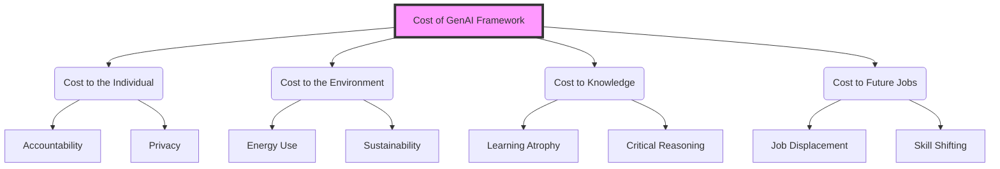

# Responsible Use of AI in Multimodal Context

:::info Attribution
**Original work**: "Educators' guide to multimodal learning and Generative AI" — Tünde Varga-Atkins, Samuel Saunders, et al. (2024/25) — [CC BY-NC 4.0](https://creativecommons.org/licenses/by-nc/4.0/)  
**Adapted for UK Nursing Education by**: Lincoln Gombedza, RN (LD)  
**Last Updated**: December 2025
:::

Despite the way GenAI is often marketed as efficient, trustworthy, innovative and invaluable to boosting users' productivity, integrating GenAI into multimodal learning brings substantial pedagogical, social and ethical challenges.

## The Reality Check

The responsible use of multimodal GenAI in nursing education requires a careful balance of:

- **Ethical considerations**
- **Pedagogical effectiveness** 
- **Legal compliance**
- **Practical sustainability**

### Key Concerns:

1. **Accuracy** — AI's outputs can contain errors or hallucinations
2. **Bias** — Reflects entrenched social biases in training data
3. **Over-reliance** — May weaken student voice or critical thinking
4. **Uncertainty** — Educators and students feel unsure about effective, ethical use
5. **Policy ambiguity** — Institutional policies may be vague or unclear

:::warning For Nursing Education
These concerns are amplified in nursing where accuracy and patient safety are paramount. A hallucinated medication dose or incorrect clinical procedure could have serious consequences if students don't verify information against authoritative sources.
:::

## Four Key Cost Areas

Beckingham and Hartley (2025a) suggest four areas to consider when looking at the cost of using GenAI:

### 1. Cost to the Individual
* **Accountability**: Students must take responsibility for AI-generated work. Academic integrity and professional honesty are paramount.
* **Privacy**: Sharing patient or personal data with AI models poses significant risks. Identifying details must never be uploaded.
* **Cognitive Load**: Over-reliance can lead to "skill atrophy" where critical thinking and basic competencies weaken over time.
* **Emotional Impact**: Anxiety about "keeping up" and imposter syndrome ("did I write this or did the AI?") are growing concerns.

[Read more about individual costs &rarr;](./cost-individual)

### 2. Cost to the Environment
* **Energy Consumption**: Generative AI models consume vast amounts of electricity for both training and daily queries (far more than standard web searches).
* **Carbon Footprint**: Data centers contribute significantly to global emissions. Nursing's commitment to public health includes environmental stewardship.
* **E-Waste**: The demand for powerful hardware accelerates device obsolescence, adding to the toxic e-waste stream.

[Read more about environmental costs &rarr;](./cost-environment)

### 3. Cost to Knowledge
* **The "Google Effect"**: We tend to remember *where* to find information rather than the information itself. In clinical practice, immediate internal knowledge is often required.
* **Learning Paradox**: Efficiency isn't always effective. The "struggle" of learning builds neural pathways; AI shortcuts can bypass this essential cognitive effort.
* **Epistemic Trust**: A shift from trusting peer-reviewed research to trusting opaque algorithmic outputs can erode evidence-based practice.

[Read more about knowledge costs &rarr;](./cost-knowledge)

### 4. Cost to Future Jobs
* **Displacement vs. Transformation**: While nursing involves irreplaceable human connection, administrative and diagnostic tasks will shift.
* **New Competencies**: "AI Literacy" is becoming a core skill alongside clinical competence.
* **Human Premium**: Skills that AI cannot replicate—empathy, complex ethical judgment, and physical care—will become even more valuable.

[Read more about future employment implications &rarr;](./cost-jobs)

*Beckingham and Hartley (2025a) Four Key Cost Areas*

Let's explore each in depth:

---

## Next Steps

To understand these costs and how to mitigate them, read the following pages:

- [Cost to the Individual](./cost-individual) — Personal responsibility and accountability
- [Cost to the Environment](./cost-environment) — Energy use and sustainability
- [Cost to Knowledge](./cost-knowledge) — Impact on learning and retention
- [Cost to Future Jobs](./cost-jobs) — Employment implications for nursing

Then explore:
- [Practical Implications](./implications) — What this means for nursing education
- [Responsible Use Checklist](./checklist) — Actionable steps for educators
