# 🤝 Collaborative Learning with AI

:::info Attribution
**Original work**: "Educators' guide to multimodal learning and Generative AI" — Tünde Varga-Atkins, Samuel Saunders, et al. (2024/25) — [CC BY-NC 4.0](https://creativecommons.org/licenses/by-nc/4.0/)  
**Adapted for UK Nursing Education by**: Lincoln Gombedza, RN (LD)  
**Last Updated**: December 2025
:::

Generative AI introduces a new dynamic to collaborative learning: the "non-human" collaborator. This section explores how to facilitate effective group work that includes AI tools.

## 🤖 AI as a "Team Member"

In group projects, AI can be assigned a specific role to support human students.

  

    

      

        <h3>👿 The Devil's Advocate</h3>
      

      

        
<strong>Goal:</strong> Challenge groupthink.

        
<strong>Action:</strong> Feed a plan to AI and ask: <em>"Identify 3 safety risks or points of failure we missed."</em>

      

    

  

  

    

      

        <h3>📝 The Note-Taker</h3>
      

      

        
<strong>Goal:</strong> Synthesize discussion.

        
<strong>Action:</strong> Record (with consent) a brainstorm and ask AI to: <em>"Summarize our 3 key themes."</em>

      

    

  

---

## 🔄 Strategy: Think-Pair-Share-AI

A simple modification of the classic teaching strategy to include AI as a distinct "voice":

```mermaid
graph LR
    A["🧠 Think<br/>(Individual Reflection)"] --> B["👥 Pair<br/>(Discuss with Partner)"]
    B --> C["🗣️ Share<br/>(Group Feedback)"]
    C --> D["🤖 AI Critique<br/>(Compare with AI)"]
    
    style A fill:#e3f2fd,stroke:#2196f3
    style B fill:#e8f5e9,stroke:#4caf50
    style C fill:#fff3e0,stroke:#ff9800
    style D fill:#f3e5f5,stroke:#9c27b0,stroke-dasharray: 5 5
```

**Activity Example**:
1.  **Think**: "What are barriers to discharge planning?"
2.  **Pair**: Discuss with neighbor.
3.  **Share**: Class discussion.
4.  **AI**: Ask ChatGPT the same question. *Did it miss the social factors? Did it find a policy we missed?*

---

## 🎭 Interdisciplinary Simulation

AI can simulate professionals from other fields to create interdisciplinary case conferences.

:::note 🏥 Scenario: Complex Discharge Planning
**The Patient**: A 75-year-old with femoral fracture and early dementia.
**The Student**: Plays the **Nurse**.
**The AI**: Plays the **Social Worker** and **Occupational Therapist**.
:::

### 💬 Sample Interaction Script

> **Student (Nurse)**: "I'm concerned about Mrs. Jones' mobility at home. She lives alone."
>
> **AI (Occupational Therapist)**: "I can arrange a home assessment. However, looking at her notes, does she have downstairs toileting? If not, we might need a commode or a hospital bed downstairs before discharge."
>
> **AI (Social Worker)**: "I need to check her care package funding. Has a financial assessment been triggered yet? We can't restart the package until that's confirmed."
>
> **Student (Nurse)**: *[Must synthesize this to coordinate the discharge date]*

---

## ⚠️ Risk: The "Social Loafing" Trap

:::warning Avoid Dependency
There is a risk that students may over-rely on AI to do the "heavy lifting" in group work (social loafing).

**Mitigation Strategies**:
1.  **Process over Product**: Grade the *prompt history*, not just the final essay.
2.  **Video Reflection**: Groups record a 2-minute video explaining *how* they verified the AI's work.
3.  **Human-In-The-Loop**: Mandate that every AI contribution must be manually annotated with a "Verification Check".
:::

---

**Next**: Check out [AI Literacy Activities](./ai-literacy-activities) for specific student exercises!
