  

# Teaching with Multimodal Gen AI

:::info Attribution
**Original work**: "Educators' guide to multimodal learning and Generative AI" — Tünde Varga-Atkins, Samuel Saunders, et al. (2024/25) — [CC BY-NC 4.0](https://creativecommons.org/licenses/by-nc/4.0/)  
**Adapted for UK Nursing Education by**: Lincoln Gombedza, RN (LD)  
**Last Updated**: December 2025
:::

Generative AI (GenAI) is not just a text generator; it is a **multimodal engine**. It allows educators to move fluidly between text, image, audio, and video, amplifying your ability to cater to diverse learning styles.

## 🚀 The Amplification Effect

Think of GenAI as a lens that takes your core teaching idea (the "Prompt") and refracts it into multiple formats:

```mermaid
graph LR
    Input[Educator Expertise<br/>Core Concept] --> Engine{GenAI<br/>Engine}
    Engine --> Visual[🖼️ Visuals<br/>Anatomy/Flowcharts]
    Engine --> Audio[🎙️ Audio<br/>Podcasts/Narratives]
    Engine --> Video[🎥 Video<br/>Simulations/Explainers]
    Engine --> Text[📝 Text<br/>Scenarios/Quizzes]
    
    style Input fill:#ffffd0,stroke:#fbc02d,stroke-width:2px
    style Engine fill:#e1f5fe,stroke:#01579b,stroke-width:2px,stroke-dasharray: 5 5
    style Visual fill:#f3e5f5,stroke:#7b1fa2
    style Audio fill:#e8f5e9,stroke:#2e7d32
    style Video fill:#fff3e0,stroke:#e65100
    style Text fill:#fce4ec,stroke:#c2185b
```

## 🏥 Why This Matters for Nursing

*   📝 **Convert** lecture notes on diabetes into a **Podcast** for students commuting to placement.
*   📊 **Transform** complex care pathway text into a visual **Flowchart**.
*   🎥 **Turn** a written case study into a **Video Script** or simulated dialogue.
*   🖼️ **Create** bespoke **Anatomical Diagrams** that highlight exactly what you need.

:::tip Shift Your Role
Your role shifts from **"Content Creator"** (writing everything from scratch) to **"Content Architect"** (designing the structure and curating the AI's output).
:::

---

## 🧭 Explore This Section

Dive into specific guides for enhancing your teaching:

  

    

      

        <h3>🎨 Creating Visual Content</h3>
      

      

        
Generate diagrams, posters, and anatomical illustrations.

      

      

        <a href="./creating-visual-content" className="button button--primary button--block">Visual Tools →</a>
      

    

  

  

    

      

        <h3>🎤 Teaching Delivery</h3>
      

      

        
AI-powered Q&A chatbots and multimedia lecture components.

      

      

        <a href="./teaching-delivery" className="button button--primary button--block">Delivery Methods →</a>
      

    

  

  

    

      

        <h3>🤝 Collaborative Learning</h3>
      

      

        
Brainstorming, design thinking, and group scenarios.

      

      

        <a href="./collaborative-learning" className="button button--secondary button--block">Group Activities →</a>
      

    

  

  

    

      

        <h3>🧠 AI Literacy Activities</h3>
      

      

        
Teaching students to prompt and critique (The "Red Pen" method).

      

      

        <a href="./ai-literacy-activities" className="button button--secondary button--block">Student Exercises →</a>
      

    

  

  

    

      

        <h3>🌟 Benefits</h3>
      

      

        
From efficiency to engagement.

      

      

        <a href="./benefits" className="button button--info button--block button--outline">Why do this?</a>
      

    

  

  

    

      

        <h3>💡 Practical Tips</h3>
      

      

        
Time-saving hacks and ethical checklists.

      

      

        <a href="./practical-tips" className="button button--info button--block button--outline">Get Tips</a>
      

    

  

  

    

      

        <h3>🩺 Examples</h3>
      

      

        
Specific nursing use cases.

      

      

        <a href="./nursing-examples" className="button button--info button--block button--outline">View Cases</a>
      

    

  

---

## ⚖️ Critical & Ethical Orientation

Embedding GenAI demands a critical stance.

:::caution Handle with Care
**AI-generated content is only as good as its training data.**
It may reproduce stereotypes (e.g., all nurses as female) or hallucinate medical facts.

**Your Responsibility**:
1.  **Verify** everything against NICE/BNF.
2.  **Scaffold** students to spot errors.
3.  **Model** transparent use.
:::

**Ready to start?** Pick a card above to jump in! 🚀
